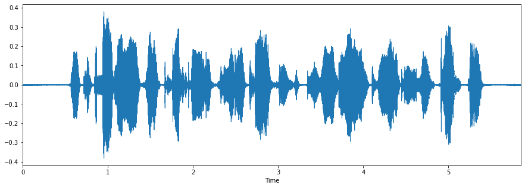
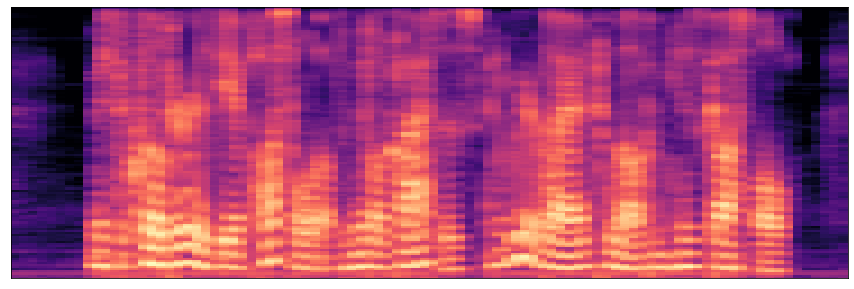

# Speech To Text Conversion
Repo Contains NLP implementation Of Project in Speech To Text Conversion Folder

THIS REPO IS DIVIDED INTO TWO PARTS:
  * **Speech To Text Conversion** :It contains code for preprocessing of audio data and training of dataset Using Defined Attention Model in pytorch.
  * **S2T_T2S** :It contains implementation Of speech to text Conversion Using API method(with Google API)

## Dataset

[openSLR LibriSpeech Dataset](http://www.openslr.org/12)

For this project dev-other.tar.gz file from LibriSpeech of size 332 MB is used.

## PreProcessing Of Audio Data:

#### Audio file:

[Audio File](Data/1272-128104-0000.flac)

#### Amplitude Vs Time plot of Audio:

#### Melspectrogram of  Audio:

## Training:

Using Defined Attention Model, dataset is trained in pytorch
